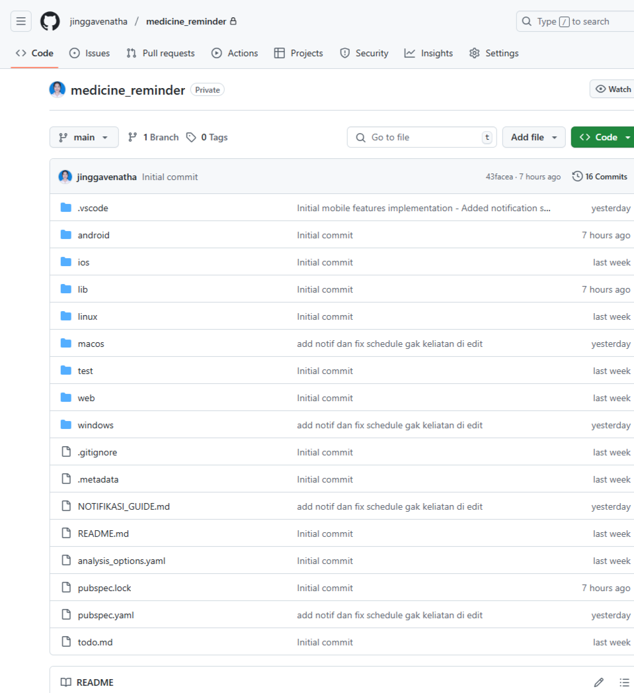

# "MEDICINE REMINDER" – APLIKASI PENGINGAT MINUM OBAT
### Oleh : Jingga Venatha Lisdabrani - 2315091027 - 4C

## APLIKASI PROJECT UJIAN AKHIR SEMESTER PEMROGRAMAN MOBILE, DOWNLOAD DISINI YAA
Ini link nya: https://drive.google.com/drive/folders/1eXjFqR9jva1tHC7Rgg3e63ITaq4IRdl_?usp=sharing

- [Medicine Reminder](releases/tag/v1.0.0) 

### Cara Install:
1. Download file APK di atas
2. Aktifkan "Install dari sumber tidak dikenal" di pengaturan HP
3. Install aplikasi
4. Buka dan mulai gunakan

### Screenshots
Ini adalah screenshot dari riwayat commit di repo saya yang lain, namun tidak saya gunakan karena di tengah pembuatan aplikasi file nya error dan saya tidak bisa memperbaikinya, akhirnya saya push projek saya yang belum rusak ke repo baru, yaitu repo yang sekarang ini "jinggavenatha/uaspemob"

